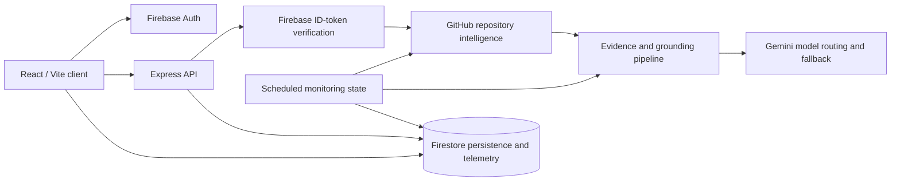

# LinkedIn Authority

GitHub repository analysis and AI-assisted technical post drafting for developers and technical teams.

**Status: Active development / beta**

This project explores how repository structure, documentation, and recent engineering activity can be turned into grounded, editable LinkedIn content. It is intentionally unfinished and is useful as a working full-stack and AI-engineering portfolio project.

## Problem explored

Technical work is often difficult to explain consistently outside the codebase. This project experiments with extracting concrete repository evidence and turning it into a reviewable narrative without asking a developer to start from a blank page.

## What currently works

- Firebase Authentication with Google and GitHub sign-in.
- Authenticated repository analysis through the Express API.
- GitHub metadata, README, manifest, commit, pull-request, and issue intelligence.
- Structured evidence extraction, conflicts, intent-aware generation, and audience-aware generation.
- Gemini model routing with configured fallback handling.
- HMAC-signed, expiring analysis sessions that bind generated work to a user and repository.
- Deterministic extraction and selection of links found in repository content for suggested calls to action.
- Firestore persistence for settings, projects, drafts, automation state, and AI usage telemetry.
- Server-side entitlement lookup, authenticated protection across API surfaces, and scheduled repository-monitoring infrastructure with tier-based project caps.
- Activity-delta/checkpoint logic that avoids generation when monitored repositories have no relevant changes.
- Automated tests for contexts, services, AI flows, and automation behavior.

## Product flow

1. A user signs in and selects a GitHub repository.
2. The server fetches repository context and normalizes the relevant evidence.
3. Gemini produces structured angles or a grounded technical draft.
4. The user reviews and edits the result, then saves it as a draft.
5. Optional automation checks monitored repositories and stores new drafts when activity changes.

## Architecture



The browser uses Firebase for authentication and user-scoped data access. Protected API requests carry a Firebase ID token; the Express server verifies it before invoking the AI routes. GitHub context is transformed into structured evidence before Gemini generation. Firestore stores user-scoped settings, projects, drafts, checkpoints, and usage telemetry.

## Engineering highlights

### Grounded AI generation

Repository analysis uses structured response schemas and separates observed evidence from generated narrative. Analysis sessions are signed with an HMAC and expire, preventing a generated result from being reused across users or repositories. Deep analysis combines stable repository identity with recent commits, pull requests, and issues.

### Model routing and observability

`server/services/repositoryIntelligence/modelRouting.ts` and the Gemini service select models by task and provide configured fallback behavior. AI calls record task, model, token, latency, and estimated-cost telemetry when the telemetry store is available.

### Persistence and automation

Firestore provides user-scoped persistence for drafts and project monitoring configuration. The automation route checks activity deltas, stores checkpoints only after draft persistence, and uses an expiring lease as a best-effort duplicate-run guard.

### Authentication and security model

Gemini API secrets are loaded server-side. Firestore rules restrict user data to the authenticated owner and keep entitlement fields server-managed. New GitHub connections are sent once to the server and stored encrypted in an Admin-only credential record; they are not sent with each AI request. Existing accounts may still have legacy `settings.githubToken` records and require a reviewed migration before Public Beta.

The reviewed migration command is dry-run by default and never prints token values:

```bash
npm run migrate:github-credentials
GITHUB_MIGRATION_COMMIT=true GITHUB_MIGRATION_REMOVE_LEGACY=true npm run migrate:github-credentials
```

Run the second command only after inspecting the dry-run output and confirming the encryption key and backup/rollback procedure for the target Firebase project.

## Testing and quality

```bash
npm run lint
npm test
npm run build
npm run test:production-smoke
npm run closed-beta:preflight
```

The repository currently has 46 Vitest files and 210 passing tests, including deterministic content-quality Golden/Regression invariants, server-side claim-audit reasons, full-claim coverage guards, exact numeric and semantic outcome guards, qualifier guards, contradictory-change guards, semantic action-direction/object-relation checks, Arabic claim grounding, credential-migration planning and disconnect cleanup, private-access fail-closed behavior, malformed-input rejection, recoverable repository-load error states for repositories, repository details, drafts, custom templates, and automations, inline operation-error recovery for repository analysis, settings, automation, draft actions, and authentication, draft conflict comparison/resolution, conservative three-way draft merge with explicit conflict markers, safe authentication and repository-operation error handling, keyboard-operable repository cards and view controls, local no-API Demo Mode, fail-closed entitlement lookup and Firestore rate-limit behavior, atomic server-side automation project limits, unified daily cost ceilings and entitlement limits, separate capability budgets for commit analysis and draft refinement, content-free product telemetry counters and funnel milestones, bounded operator telemetry reporting and direct aggregate-read coverage, retention-policy checks including telemetry expiry, protected retention-route checks, account export/deletion route coverage including recursive draft-history deletion and idempotent Auth retry behavior, authenticated automation-history and project-deletion route coverage, public-only/private-opt-in GitHub credential scope enforcement, server-backed GitHub detail caching with timeout and concurrent-request coalescing, checkpoint-filtered incremental deep scans, versioned repository snapshots with architecture/feature/capability/evidence metadata, low-cost Gemini model routing with date-aware pricing, evidence-preserving draft refinement, no periodic GitHub rate-limit polling, the guard that prevents per-card GitHub activity requests, AI error sanitization, review-first legal-copy contracts, public-demo clipboard recovery, repository-detail clipboard recovery, Arabic result-label localization, localized help accessibility, account-export confirmation, commit-only no-fabricated-link handling, and dependency security verification with `npm audit` reporting zero vulnerabilities. `npm run test:e2e` adds 14 isolated Playwright tests for the public draft journey, failure recovery, locale rendering, authenticated draft persistence, authenticated page-surface plus legal/help coverage, primary workspace page contracts in Arabic/English/German, German repository-detail coverage, a disconnected-account local Demo Mode path, onboarding continuation with public repositories without OAuth, mobile workspace coverage, unknown-route recovery, template-to-draft creation, the pause/resume automation path, and the versioned PWA shell/manifest contract. `npm run test:production-smoke` boots the bundled server and checks its health, SPA shell, versioned service-worker cache policy, auth guard, cron guard, App Hosting secret configuration, and chunked request-size rejection without external API calls. Firestore Rules Emulator coverage includes ownership, server-managed paths, draft-only status/schema enforcement, append-only revisions, server-mediated deletion, and rejection of legacy LinkedIn tokens. The TypeScript check and production build also pass. Route-level vendor splitting keeps the main frontend chunk around 300 kB minified; Firebase Firestore remains a separately loaded large dependency and is a follow-up optimization.

The operator checklist for encrypted credential migration, scheduler setup, retention, staging verification, rollback, and the Closed Beta invite gate is in [`docs/operations/CLOSED_BETA_RUNBOOK.md`](docs/operations/CLOSED_BETA_RUNBOOK.md). Run `npm run closed-beta:preflight -- --strict` only inside the provisioned environment; it validates secret presence and shape without printing secret values.

## Tech stack

- React 19, React Router, TypeScript, Vite
- Tailwind CSS, Framer Motion, Recharts, Lucide
- Node.js, Express, TypeScript runtime tooling, esbuild
- Firebase Authentication, Firestore, and Firebase Admin SDK
- Google Gemini via `@google/genai`
- Vitest, Testing Library, Supertest

## Running locally

Requirements: Node.js 22+ and npm (`.nvmrc` is included).

```bash
npm install
cp .env.example .env
npm run dev
```

Configure at least `GEMINI_API_KEY`, `ANALYSIS_SIGNING_SECRET`, and `CRON_SECRET` in `.env`. There is no default cron secret. Server-side Firebase Admin operations also require the normal Google Application Default Credentials or an explicitly configured service-account environment. The Firebase Web configuration in `firebase-applet-config.json` is client configuration and is intentionally browser-visible.

## Current limitations

- Direct LinkedIn publishing is not implemented.
- Scheduling and automation prepare or store drafts; they do not publish to LinkedIn.
- Official LinkedIn analytics and reach projections are not implemented in this beta.
- Legacy GitHub token records require a reviewed migration before Public Beta; new connections use the server-side encrypted credential path. Legacy LinkedIn token fields are rejected by current client rules and stripped from client state.
- Account deletion and broader production hardening are incomplete.
- Some legacy UI and documentation paths remain under active development.

## Roadmap

Planned capabilities are separate from the current implementation:

- A reviewed migration and retention procedure for legacy credentials, plus narrower integration permissions.
- Deployed verification of account-deletion and the protected operational-retention workflow.
- LinkedIn publishing only after its OAuth, consent, and safety model are implemented.
- Official analytics integration if the required platform access becomes available.
- More transactional automation leasing, quotas, and operational controls.

## Documentation

- [API reference](docs/api/API.md)
- [AI generation notes](docs/api/ai_generation.md)
- [Persistence and Firestore rules](docs/architecture/database_schema.md)
- [Developer handoff](docs/development/developer_handoff.md)

## Attribution

Developed by **Obada Dallo**. The repository is shared as an active-development portfolio project; no open-source license is currently declared.
