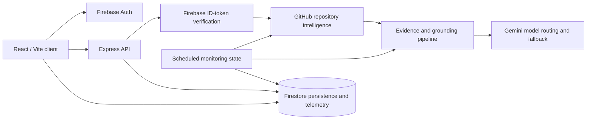

# LinkedIn Authority

GitHub repository analysis and AI-assisted technical post drafting for developers and technical teams.

**Status: Active development / beta**

This project explores how repository structure, documentation, and recent engineering activity can be turned into grounded, editable LinkedIn content. It is intentionally unfinished and is useful as a working full-stack and AI-engineering portfolio project.

## Problem explored

Technical work is often difficult to explain consistently outside the codebase. This project experiments with extracting concrete repository evidence and turning it into a reviewable narrative without asking a developer to start from a blank page.

## What currently works

- Firebase Authentication with Google and GitHub sign-in.
- Authenticated repository analysis through the Express API.
- GitHub metadata, README, manifest, commit, pull-request, and issue intelligence.
- Structured evidence extraction, conflicts, intent-aware generation, and audience-aware generation.
- Gemini model routing with configured fallback handling.
- HMAC-signed, expiring analysis sessions that bind generated work to a user and repository.
- Deterministic extraction and selection of links found in repository content for suggested calls to action.
- Firestore persistence for settings, projects, drafts, automation state, and AI usage telemetry.
- Server-side entitlement lookup, authenticated rate limiting, and scheduled repository-monitoring infrastructure.
- Activity-delta/checkpoint logic that avoids generation when monitored repositories have no relevant changes.
- Automated tests for contexts, services, AI flows, and automation behavior.

## Product flow

1. A user signs in and selects a GitHub repository.
2. The server fetches repository context and normalizes the relevant evidence.
3. Gemini produces structured angles or a grounded technical draft.
4. The user reviews and edits the result, then saves it as a draft.
5. Optional automation checks monitored repositories and stores new drafts when activity changes.

## Architecture



The browser uses Firebase for authentication and user-scoped data access. Protected API requests carry a Firebase ID token; the Express server verifies it before invoking the AI routes. GitHub context is transformed into structured evidence before Gemini generation. Firestore stores user-scoped settings, projects, drafts, checkpoints, and usage telemetry.

## Engineering highlights

### Grounded AI generation

Repository analysis uses structured response schemas and separates observed evidence from generated narrative. Analysis sessions are signed with an HMAC and expire, preventing a generated result from being reused across users or repositories. Deep analysis combines stable repository identity with recent commits, pull requests, and issues.

### Model routing and observability

`server/services/repositoryIntelligence/modelRouting.ts` and the Gemini service select models by task and provide configured fallback behavior. AI calls record task, model, token, latency, and estimated-cost telemetry when the telemetry store is available.

### Persistence and automation

Firestore provides user-scoped persistence for drafts and project monitoring configuration. The automation route checks activity deltas, stores checkpoints only after draft persistence, and uses an expiring lease as a best-effort duplicate-run guard.

### Authentication and security model

Gemini API secrets are loaded server-side. Firestore rules restrict user data to the authenticated owner and keep entitlement fields server-managed. The current beta still stores GitHub integration tokens in user settings for the existing client flow; this is a documented limitation, not a dedicated production token vault.

## Testing and quality

```bash
npm run lint
npm test
npm run build
```

The repository currently has 15 test files and 82 passing tests. The TypeScript check and production build also pass. The build currently reports an oversized frontend bundle warning; this is known follow-up work.

## Tech stack

- React 19, React Router, TypeScript, Vite
- Tailwind CSS, Framer Motion, Recharts, Lucide
- Node.js, Express, TypeScript runtime tooling, esbuild
- Firebase Authentication, Firestore, and Firebase Admin SDK
- Google Gemini via `@google/genai`
- Vitest, Testing Library, Supertest

## Running locally

Requirements: Node.js 20+ and npm.

```bash
npm install
cp .env.example .env
npm run dev
```

Configure at least `GEMINI_API_KEY`, `ANALYSIS_SIGNING_SECRET`, and `CRON_SECRET` in `.env`. There is no default cron secret. Server-side Firebase Admin operations also require the normal Google Application Default Credentials or an explicitly configured service-account environment. The Firebase Web configuration in `firebase-applet-config.json` is client configuration and is intentionally browser-visible.

## Current limitations

- Direct LinkedIn publishing is not implemented.
- Scheduling and automation prepare or store drafts; they do not publish to LinkedIn.
- Reach projections are estimates and are not official LinkedIn analytics.
- GitHub token handling remains a beta limitation because the current client flow stores the integration token in user settings.
- Account deletion and broader production hardening are incomplete.
- Some legacy UI and documentation paths remain under active development.

## Roadmap

Planned capabilities are separate from the current implementation:

- A server-side token vault and narrower integration permissions.
- Complete, verified account-deletion and retention workflows.
- LinkedIn publishing only after its OAuth, consent, and safety model are implemented.
- Official analytics integration if the required platform access becomes available.
- More transactional automation leasing, quotas, and operational controls.

## Documentation

- [API reference](docs/api/API.md)
- [AI generation notes](docs/api/ai_generation.md)
- [Persistence and Firestore rules](docs/architecture/database_schema.md)
- [Developer handoff](docs/development/developer_handoff.md)

## Attribution

Developed by **Obada Dallo**. The repository is shared as an active-development portfolio project; no open-source license is currently declared.
