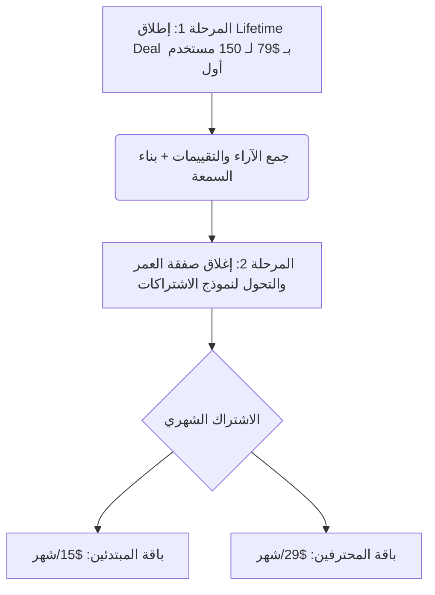

# 📊 دراسة استراتيجية التسعير وتحليل المنافسين | LinkedIn Authority Engine

تهدف هذه الدراسة إلى تقديم تحليل شامل وخيارات تسعير مدروسة لأداة **LinkedIn Authority Engine** بناءً على قيمة المنتج والجمهور المستهدف وتكلفة التشغيل والمقارنة مع المنافسين في السوق.

---

## 1. تحليل القيمة والميزة التنافسية (Value Proposition)

تتميز الأداة بتركيزها الحصري على **المطورين، المبرمجين المستقلين (Indie Hackers)، وقادة الفرق التقنية**؛ حيث تقوم بتحليل الشيفرة البرمجية والمستودعات بشكل مباشر لتوليد محتوى احترافي يخدم استراتيجية التسويق عبر البناء العلني (Build in Public).

| الجانب | التوضيح |
| :--- | :--- |
| **الجمهور المستهدف** | المطورون، رواد الأعمال التقنيين (Solopreneurs)، ومدراء الهندسة البرمجية. |
| **القيمة الأساسية** | توفير ساعات من كتابة المحتوى التقني من خلال تحويل الالتزامات (Commits) والتغييرات البرمجية إلى منشورات LinkedIn رصينة وجذابة. |
| **الحد من التكاليف** | التحكم في تكاليف استهلاك الـ LLM (Gemini API) عبر وضع أسقف واضحة للباقات. |

---

## 2. مقارنة مع المنافسين في السوق

| الأداة | طبيعة الخدمة | التسعير الشهري | الميزات | نقاط الضعف مقارنة بأداتك |
| :--- | :--- | :--- | :--- | :--- |
| **Taplio** | توليد وجدولة محتوى عام بالذكاء الاصطناعي | **$49 - $149** | جدولة، تحليلات، بنك منشورات شائعة | لا تفهم الكود البرمجي ولا ترتبط بـ GitHub بشكل تفاعلي. |
| **AuthoredUp** | منسق محتوى ومعاينة مظهر المنشورات | **$19.95** | تنسيق خطوط، معاينة مظهر البوست على الجوال | لا تحتوي على ذكاء اصطناعي لتوليد المحتوى من الأساس. |
| **AppSumo (بدائل مختلفة)** | أدوات كتابة عامة بصفقة مدى الحياة | **$49 - $99 (مرة واحدة)** | توليد محتوى عام | جودة توليد الأفكار التقنية ضعيفة ومكررة. |

---

## 3. خيارات نماذج التسعير المقترحة

### الخيار الأول: نموذج الاشتراكات المتكررة (SaaS Model) - *[موصى به للمدى الطويل]*
يضمن هذا النموذج تغطية التكاليف التشغيلية المتكررة لاستدعاء الـ APIs.

#### 1. الباقة الأساسية (Starter Plan)
* **السعر المقترح:** **$15 / شهرياً** (أو $120 سنويًا - خصم 33%).
* **الميزات والحدود:**
  * ربط حساب GitHub واحد وحساب LinkedIn واحد.
  * توليد حتى **30 منشورًا شهريًا** بالذكاء الاصطناعي.
  * قراءة المستودعات العامة فقط (Public Repositories).
  * جدولة أساسية.

#### 2. الباقة الاحترافية (Pro Plan) - *[الباقة الأكثر شعبية]*
* **السعر المقترح:** **$29 / شهرياً** (أو $240 سنويًا - خصم 30%).
* **الميزات والحدود:**
  * ربط حسابات متعددة مع دعم مستودعات المنظمات (Organizations).
  * توليد غير محدود للمنشورات بالذكاء الاصطناعي (مع تطبيق سياسة الاستخدام العادل).
  * قراءة وتحليل المستودعات الخاصة (Private Repositories).
  * تحليلات متقدمة للأداء وتوليد هاشتاغات ذكية متكررة.
  * جدولة ذكية في أوقات الذروة (Peak-Hours Scheduling).

---

### الخيار الثاني: صفقة العمر لمرة واحدة (Lifetime Deal - LTD) - *[ممتاز لجذب المستخدمين الأوائل]*
يُستخدم لجمع سيولة سريعة وبناء قاعدة عملاء أولية تقدم آراءً وتقييمات للمنتج.

* **السعر المقترح لمرة واحدة:** **$79 (One-Time Payment)**.
* **شروط هامة لحماية أرباحك من تكاليف الـ API:**
  * تحديد سقف أقصى للتوليد بالذكاء الاصطناعي بـ **50 إلى 60 منشورًا شهريًا** لكل ترخيص شراء.
  * اقتصار الربط على المستودعات العامة والخاصة الشخصية فقط (بدون دعم حسابات الفرق الكبيرة).
  * إمكانية ترقية الترخيص (Double Code) بـ $149 لزيادة الليميت الشهري.

---

## 4. خطة الإطلاق والتسعير المقترحة (Rollout Strategy)

1. **إطلاق صامت وعرض لمرة واحدة (LTD):** بيع 150 ترخيصاً فقط بسعر $79 لجمع رأس مال مبدئي واختبار استقرار الخوادم.
2. **فترة الانتقال:** التواصل مع المشترين الأوائل وتعديل العيوب بناءً على تجربتهم الفعلية.
3. **التحول إلى SaaS:** بعد شهرين، يتم إغلاق عرض مدى الحياة نهائياً وفتح باقات الاشتراك الشهري المذكورة أعلاه للجمهور العام.
